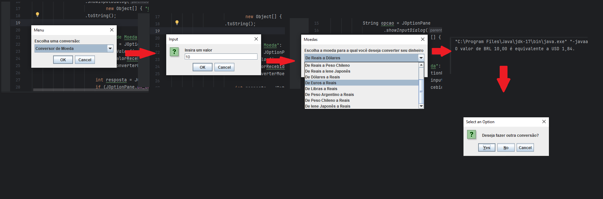

<h1 align="center"> Conversor de moedas </h1>

Challenge ONE Back End - Java.

Sprint 01: Crie seu próprio conversor de moeda.

 

  

## 🚀 Tecnologias

Esse projeto foi desenvolvido com as seguintes tecnologias:

- Java
- Trello

## 💻 Projeto

## 4. ✅ Implementações
- [x] Aplicação final
    - [x] Importando biblioteca Gson;
    - [x] Construir o Cliente para solicitações(HttpClient);
    - [x] Construindo a Requisição (HttpRequest);
    - [x] Construindo a Resposta (HttpResponse);
    - [x] Analisando a resposta em formato JSON;
    - [x] Filtrando as moedas;
    - [x] Convertendo os valores.

Uma aplicação que converte moedas atraves de uma api externa, assim você pode saber quanto que é reais para dolares por exemplo.
